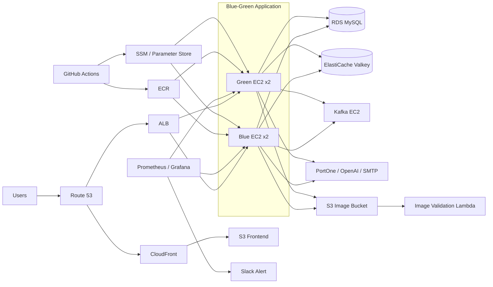

# 🍚 BobFull Technical Docs

합석형 좌석 예약 플랫폼 **BobFull(밥풀)**의 기술 문서·포트폴리오 자료 허브입니다.

[🏠 Project Home](https://github.com/bobfull-project) · [🔬 Flow Lab](https://bobfull-project.github.io/bobfull-docs/flow-lab/v3/operations-flow-lab/) · [⚙️ Backend](https://github.com/bobfull-project/bobfull-backend) · [🖥️ Frontend](https://github.com/bobfull-project/bobfull-frontend)

> 처음 보는 분께는 **[System Architecture](./architecture/system-architecture.md) → [대표 ADR 10선](./adr/README.md) → [Flow Lab](https://bobfull-project.github.io/bobfull-docs/flow-lab/v3/operations-flow-lab/)** 순서를 권장합니다.

## System Architecture

BobFull의 실제 운영 구성을 한눈에 볼 수 있도록 **Frontend 전달 경로, Blue-Green App, 데이터 저장소, Kafka, 모니터링, CI/CD, 외부 서비스**를 함께 표시합니다.

> 평시에는 Blue/Green 중 **Active App EC2 2대만 서비스**하며, 배포 시 Inactive 환경을 기동해 동일 이미지를 배포·검증한 뒤 ALB Weight를 전환합니다.  
> RDS는 현재 **Single-AZ**, Kafka는 **단일 KRaft Broker**로 구성되어 있어 해당 계층의 HA까지 주장하지 않습니다.

**[▶ 상세 System Architecture와 책임 경계 보기](./architecture/system-architecture.md)**

## Documentation

| 문서 | 내용 |
|---|---|
| [System Architecture](./architecture/system-architecture.md) | 운영 기준 전체 시스템 구성 |
| [API](./api/README.md) | 도메인별 API와 권한 경계 요약 |
| [ERD](./database/erd.md) | 핵심 데이터 관계 구조 |
| [ADR](./adr/README.md) | 대표 기술 의사결정 10선 |
| [Troubleshooting](./troubleshooting/README.md) | 도메인별 문제 분석·해결 기록 |

## Flow Lab

실제 코드와 Evidence를 기반으로 BobFull의 주요 백엔드 흐름을 단계별로 확인할 수 있는 인터랙티브 시뮬레이션입니다.

**[▶ Flow Lab V3 실행하기](https://bobfull-project.github.io/bobfull-docs/flow-lab/v3/operations-flow-lab/)**

## 문서 관리 기준

- 상세 구현 계약과 Evidence의 Source of Truth는 [Backend](https://github.com/bobfull-project/bobfull-backend) 저장소입니다.
- 이 저장소는 Architecture · API · ERD · ADR · Troubleshooting을 포트폴리오 관점에서 읽기 쉽게 정리합니다.
- Flow Lab은 Backend의 `docs/flow-lab`을 기준으로 동기화해 GitHub Pages로 공개합니다.
- Troubleshooting은 각 담당자가 자신의 도메인 사례를 직접 보완합니다.
