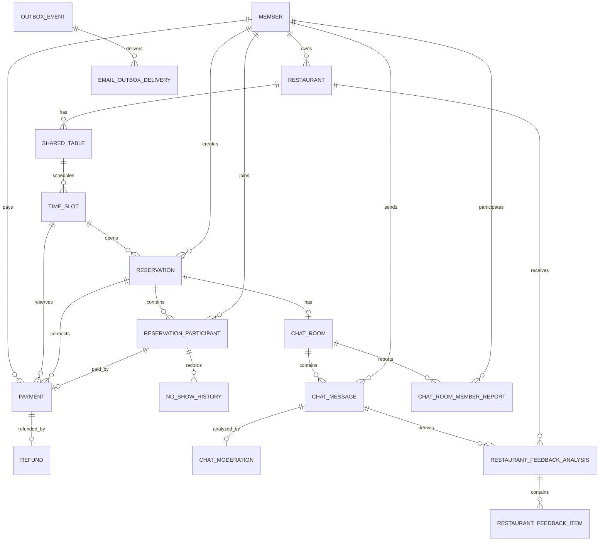

# ERD

```mermaid
erDiagram
    MEMBER ||--o{ RESTAURANT : owns
    RESTAURANT ||--o{ SHARED_TABLE : has
    SHARED_TABLE ||--o{ TIME_SLOT : schedules
    TIME_SLOT ||--o{ RESERVATION : opens

    MEMBER ||--o{ RESERVATION : creates
    RESERVATION ||--o{ RESERVATION_PARTICIPANT : contains
    MEMBER ||--o{ RESERVATION_PARTICIPANT : joins

    MEMBER ||--o{ PAYMENT : pays
    TIME_SLOT ||--o{ PAYMENT : reserves
    RESERVATION ||--o{ PAYMENT : connects
    RESERVATION_PARTICIPANT ||--o| PAYMENT : paid_by
    PAYMENT ||--o| REFUND : refunded_by

    RESERVATION_PARTICIPANT ||--o{ NO_SHOW_HISTORY : records

    RESERVATION ||--o| CHAT_ROOM : has
    CHAT_ROOM ||--o{ CHAT_MESSAGE : contains
    MEMBER ||--o{ CHAT_MESSAGE : sends
    CHAT_MESSAGE ||--o| CHAT_MODERATION : analyzed_by

    CHAT_MESSAGE ||--o{ RESTAURANT_FEEDBACK_ANALYSIS : derives
    RESTAURANT ||--o{ RESTAURANT_FEEDBACK_ANALYSIS : receives
    RESTAURANT_FEEDBACK_ANALYSIS ||--o{ RESTAURANT_FEEDBACK_ITEM : contains

    CHAT_ROOM ||--o{ CHAT_ROOM_MEMBER_REPORT : reports
    MEMBER ||--o{ CHAT_ROOM_MEMBER_REPORT : participates

    OUTBOX_EVENT ||--o{ EMAIL_OUTBOX_DELIVERY : delivers
```

[전체 ERD · 컬럼 · 인덱스 · 제약조건 보기](https://github.com/bobfull-project/bobfull-backend/blob/develop/docs/ERD.md)
